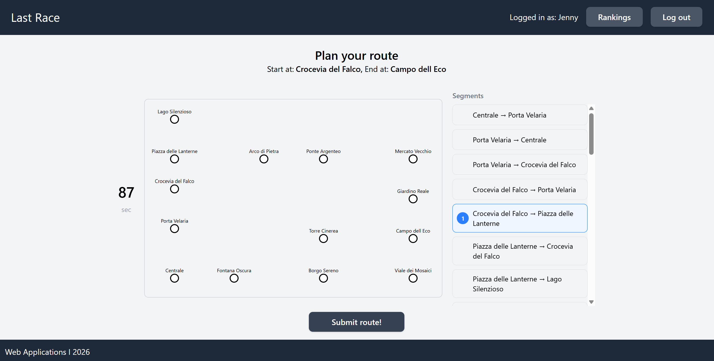
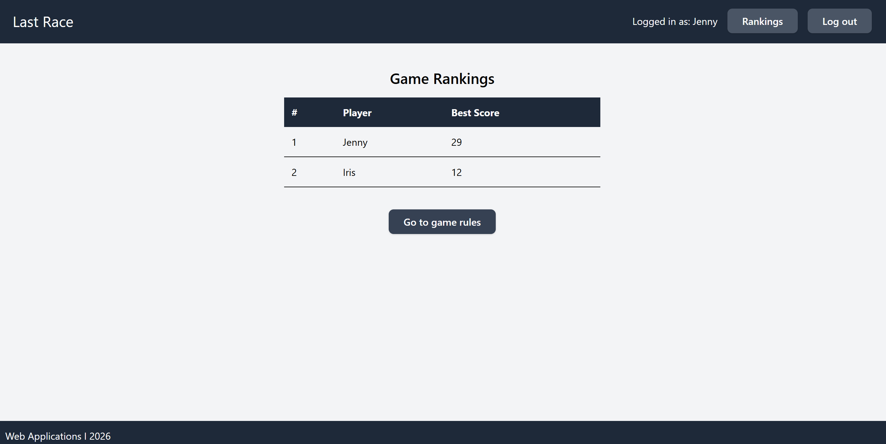

# Exam #1: Last Race
## Student: s362483 MOLANDER JENNY

## React Client Application Routes

- Route `/`: Home page — landing page with general content and navigation entry point.
- Route `/login`: Login form — unauthenticated route where users sign in to access the application.
- Route `/planning`: Planning page — protected route for the planning phase of the race/event workflow.
- Route `/executing`: Execution page — protected route for the active execution/race phase.
- Route `/result`: Result page — protected route for viewing results after a race/event is completed.
- Route `/ranking`: Ranking page — protected route displaying participant rankings/leaderboard.
- Route `/setup`: Setup page — protected route for configuring race/event settings before starting.

## API Server

- POST `/api/sessions`
  - Body: `{ username, password }`
  - Returns the logged-in user object: `{ id, username, name }`

- GET `/api/sessions/current`
  - No parameters
  - Returns the current user object: `{ id, username, name }`

- DELETE `/api/sessions/current`
  - No parameters
  - Returns 204

- GET `/api/network`
  - No parameters
  - Returns an array of lines, each with `{ id, name, color, stations: [{ station: { id, name }, position }] }`

- GET `/api/ranking`
  - No parameters
  - Returns an array of `{ user: { id, username, name }, bestScore }`

- POST `/api/games`
  - No parameters
  - Returns `{ gameId, startStation: { id, name }, destinationStation: { id, name }, status }`

- GET `/api/games/current`
  - No parameters
  - Returns the current user's active game object `{ id, userId, startStationId, destinationStationId, status, score, createdAt, route }`

- GET `/api/games/:id`
  - URL parameter: `id` (game ID)
  - Returns the game object `{ id, userId, startStationId, destinationStationId, status, score, createdAt, route }`

- POST `/api/games/:id/abandon`
  - URL parameter: `id` (game ID)
  - Returns `{ message: "Game ended" }`

- GET `/api/segments`
  - No parameters
  - Returns all segments as pairs of connected stations `{ [segment: {fromstation: {id, name}, toStation: {id, name}}, ...] }`

- GET `/api/stations`
  - No parameters
  - Returns all stations in the network `{ [station: {id, name}, ...] }`

- POST `/api/games/:id/route`
  - URL parameter: `id` (game ID)
  - Body: `{ route: [{ fromStationId, toStationId }] }`
  - Returns `{ valid, totalSteps }`

- POST `/api/games/:id/step`
  - URL parameter: `id` (game ID)
  - Body: `{ route: [{ fromStationId, toStationId }], stepIndex }`
  - Returns `{ done, randomEvent: { id, description, effect }, coinsAfterStep }`

## Database Tables

- Table `users` — stores registered users with their username, display name, and hashed password (salt + hash)
- Table `lines` — stores the metro lines with their name and color
- Table `stations` — stores all stations in the network with their name
- Table `line_stations` — junction table linking stations to lines, with a position field defining the order of stations on each line
- Table `events` — stores all possible random events with a description and a coin effect
- Table `games` — stores each game with its user, start and destination station, status, score, creation timestamp, and the submitted route
- Table `game_steps` — stores each executed step of a game, including the stations travelled, the random event that occurred, and the coin total after the step

## Main React Components

## React Components

- `MainLayout`: Top-level layout wrapper that renders the shared `Header` and `Footer` around all page routes.
- `Header`: Global navigation header displayed on all pages.
- `Footer`: Global footer displayed on all pages.
- `HomePage`: Landing page rendered at `/`.
- `LoginForm`: Authentication form rendered at `/login`.
- `PlanningPage`: Protected page for the planning phase, rendered at `/planning`.
- `ExecutionPage`: Protected page for the active execution/race phase, rendered at `/executing`.
- `ResultPage`: Protected page for viewing post-race results, rendered at `/result`.
- `RankingPage`: Protected page displaying participant rankings, rendered at `/ranking`.
- `SetUpPage`: Protected page for viewing full network before planning, rendered at `/setup`.
- `NetworkVisualizer`: Reusable component for visualizing network/graph data, used within relevant pages.

## Screenshot

## Users Credentials

- username: `JennyMol`, password: `Password` 
- username: `IrisHun`, password: `Secret`
- username: `AkselMol`, password: `Hello123`

## Use of AI Tools
I have used a combination of ChatGPT and Claude for different purposes:
- Generating text in READ.me file based on my code
- Debugging by providing the model error messages and code
- Generate inspiration code for network visualization by SVG and shortest path algorithm
- Generate some css tailwind lines and get design suggestions

I have verified the output by always making sure I fully understand what the AI does and suggests. 
